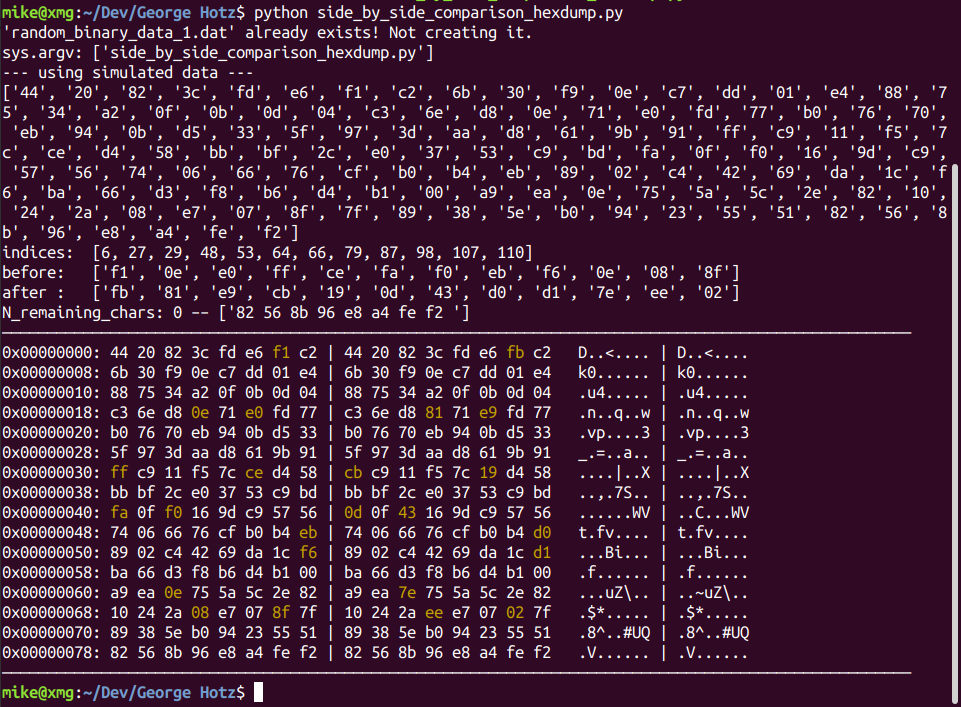

# Binary side-by-side comparison of 2 similar files

Compare binary representation of 2 files and emphasize differences.
This was inspired by [GeoHot](https://www.youtube.com/watch?v=GXy5eVwnL_Q).

Here a sample screenshot of the program at work:

